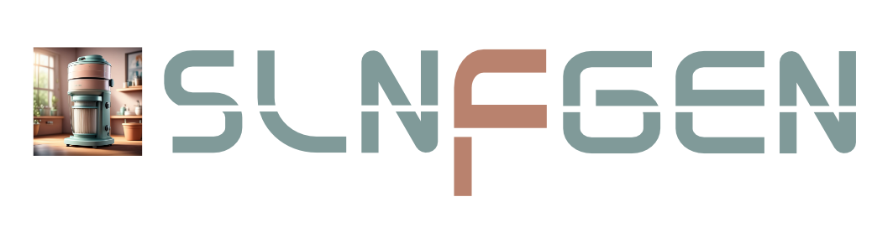

# Slnfgen CLI

### ❓ What Is It?

A CLI, or dotnet tool, that extends the .NET solution tooling with automated solution filter generation from a manifest file.

### ❓ Why Would You Use It?

If you've ever had a monolith, or distributed system, with multiple applications and services, you'll know the pain of keeping a single solution organised

- **Mono-repo tooling**: Allows automated maintenance of a .NET monorepo.
- **Cross-Platform**: Works on Windows, Linux & Mac!
- **Built with MSBuild**:

## 📦 Installation

### Local (recommended)

To install local to a repository, [setup a tool-manifest file](https://learn.microsoft.com/en-us/dotnet/core/tools/local-tools-how-to-use#create-a-manifest-file)

To automatically add Slnfgen.CLI

```bash
dotnet tool install Slnfgen.CLI
```

This can then be run as

### Global

To install globally:

```bash
dotnet tool install Slnfgen.CLI -g
```

## Usage

### Manifest File

```yml

```

- Solution:
- EntryPoints: E

### Generating Filters (with `gen`)

With a valid Manifest file, the CLI can then be executed to generate the declared solution filters

```bash
slfngen gen manifest.yml
```

Each solution file will include the entrypoints.

## 📑 More Docs

All useful documentation can be found in this readme - I promise! For the eager amongst you out there, there are some other useful bits for finding your way around using and developing with this

- **`--help`**: Appending this to any command will give you the usual.
- [**Reference**](./docs/reference.md):
- [**Changelog**](./docs/CHANGELOG.md):
- [**License**](./docs/LICENSE):
- [**Contribution Guide**](./docs/CONTRIBUTING.md):
- [**Code Of Conduct**](./docs/CODE_OF_CONDUCT.md):
